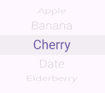
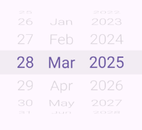
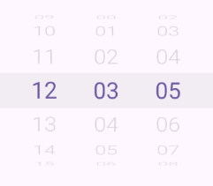
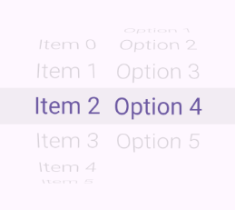
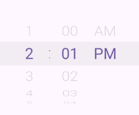
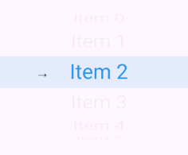
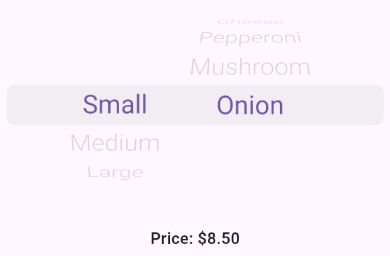
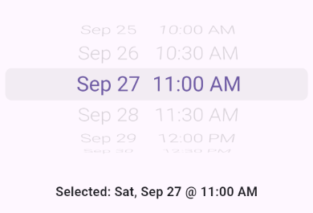

# Locuaz Wheel Pickers

A comprehensive collection of iOS-style wheel picker widgets for Flutter with advanced dependency management and performance optimization.

## Features

- **Static Wheel Pickers**: Simple, efficient pickers for basic use cases using `SimpleWheelPickerBuilder`
- **Dynamic Wheel Pickers**: Advanced pickers with selective recreation and dependency management using `SelectiveWheelPickerBuilder`
- **Specialized Widgets**: Pre-built date (`WDatePicker`), time (`WTimePicker`), and list (`WListPicker`) pickers
- **Performance Optimized**: Intelligent recreation logic reduces unnecessary rebuilds by 85%
- **Dependency Management**: Sophisticated system for handling wheel interdependencies
- **Customizable**: Extensive customization options for appearance and behavior
- **Accessibility**: Full screen reader and keyboard navigation support
- **Internationalization**: Support for multiple languages and locales

## Installation

Add this to your package's `pubspec.yaml` file:

```yaml
dependencies:
  locuaz_wheel_pickers: ^1.0.0
```

Then run:

```bash
flutter pub get
```

## Quick Start

Import the package:

```dart
import 'package:locuaz_wheel_pickers/locuaz_wheel_pickers.dart';
```

## Widget Types

### 1. WListPicker - Simple List Selection

Perfect for selecting from a list of items:

```dart
WListPicker(
  items: ['Apple', 'Banana', 'Cherry', 'Date', 'Elderberry'],
  initialIndex: 0,
  onChanged: (index) => print('Selected index: $index'),
)
```



### 2. WDatePicker - Date Selection

iOS-style date picker with customizable format:

```dart
WDatePicker(
  initialDate: DateTime.now(),
  format: EDateFormat.dMMy, // Day-Month-Year with abbreviated months
  language: Lang.en,
  onChanged: (date) => print('Selected date: $date'),
)
```



### 3. WTimePicker - Time Selection

Time picker with 12/24 hour format support:

```dart
WTimePicker(
  initialTime: WTimeOfDay(hour: 12, minute: 0, second: 0, is24Hour: true),
  use24Hour: true,
  showSeconds: true,
  onChanged: (time) => print('Selected time: $time'),
)
```



### 4. SimpleWheelPickerBuilder - Static Implementation

For simple, independent wheels that don't depend on each other:

```dart
SimpleWheelPickerBuilder(
  wheels: [
    WheelConfig(
      itemCount: 10,
      initialIndex: 0,
      formatter: (index) => 'Item $index',
      width: 100,
    ),
    WheelConfig(
      itemCount: 5,
      initialIndex: 2,
      formatter: (index) => 'Option ${index + 1}',
      width: 100,
    ),
  ],
  onChanged: (indices) => print('Selected: $indices'),
)
```



### 5. SelectiveWheelPickerBuilder - Dynamic Implementation

For complex scenarios with wheel dependencies (e.g., Country → State → City):

```dart
SelectiveWheelPickerBuilder(
  textStyle: (isSelected) => TextStyle(
    fontSize: 13, 
    color: isSelected ? Colors.blue : Colors.black
  ),
  wheels: [
    // Country wheel (independent)
    WheelConfig(
      wheelId: 'country',
      itemCount: countries.length,
      initialIndex: 0,
      formatter: (index) => countries[index].name,
      width: 120,
    ),
    // State wheel (depends on country)
    WheelConfig(
      wheelId: 'state',
      itemCount: 1, // Will be calculated dynamically
      initialIndex: 0,
      formatter: (index) => 'State $index',
      width: 100,
      dependency: WheelDependency(
        dependsOn: [0], // Depends on country wheel (index 0)
        calculateItemCount: (dependencyValues) {
          int countryIndex = dependencyValues[0];
          return countries[countryIndex].states.length;
        },
        buildFormatter: (dependencyValues) => (index) {
          int countryIndex = dependencyValues[0];
          return countries[countryIndex].states[index].name;
        },
      ),
    ),
    // City wheel (depends on both country and state)
    WheelConfig(
      wheelId: 'city',
      itemCount: 1, // Will be calculated dynamically
      initialIndex: 0,
      formatter: (index) => 'City $index',
      width: 120,
      dependency: WheelDependency(
        dependsOn: [0, 1], // Depends on country and state wheels
        calculateItemCount: (dependencyValues) {
          int countryIndex = dependencyValues[0];
          int stateIndex = dependencyValues[1];
          return countries[countryIndex].states[stateIndex].cities.length;
        },
        buildFormatter: (dependencyValues) => (index) {
          int countryIndex = dependencyValues[0];
          int stateIndex = dependencyValues[1];
          return countries[countryIndex].states[stateIndex].cities[index].name;
        },
      ),
    ),
  ],
  onChanged: (indices) => print('Selected: $indices'),
)
```


## Advanced Customization

### Custom Separators

Add custom separators between wheels:

```dart
SimpleWheelPickerBuilder(
  wheels: [
    WheelConfig(
      initialIndex: 0,
      itemCount: 12,
      formatter: (index) => '${index + 1}',
      width: 60,
      trailingSeparator: const WheelSeparators().colon(),
    ),
    WheelConfig(
      initialIndex: 0,
      itemCount: 60,
      formatter: (index) => index.toString().padLeft(2, '0'),
      width: 60,
    ),
    WheelConfig(
      initialIndex: 0,
      itemCount: 2,
      formatter: (index) => index == 0 ? 'AM' : 'PM',
      width: 60,
    ),
  ],
  onChanged: (indices) => print('Time: $indices'),
)
```



### Custom Styling

Customize appearance with wheel configuration:

```dart
SimpleWheelPickerBuilder(
  wheels: [
    WheelConfig(
      initialIndex: 0,
      itemCount: 10,
      formatter: (index) => 'Item $index',
      width: 120,
      leadingSeparator: const SizedBox(
        width: 20,
        child: Text('→', style: TextStyle(fontSize: 18)),
      ),
    ),
  ],
  selectedItemColor: Colors.blue,
  unselectedItemColor: Colors.grey,
  barColor: Colors.blue,
  onChanged: (indices) => debugPrint('Selected: $indices'),
)
```



## Common Use Cases

### Date and Time Selection

```dart
Column(
  mainAxisAlignment: MainAxisAlignment.center,
  children: [
    // Date picker
    Container(
      height: 200,
      child: WDatePicker(
        initialDate: DateTime.now(),
        onChanged: (date) => setState(() => selectedDate = date),
      ),
    ),
    SizedBox(height: 20),
    // Time picker
    Container(
      height: 200,
      child: WTimePicker(
        initialTime: WTimeOfDay.now(),
        onChanged: (time) => setState(() => selectedTime = time),
        use24hFormat: true,
      ),
    ),
  ],
)
```

### Multi-Level Dependencies

```dart
// Example: Pizza ordering system
SelectiveWheelPickerBuilder(
  wheels: [
    // Size wheel (static)
    WheelConfig(
      wheelId: 'size',
      itemCount: pizzaSizes.length,
      initialIndex: _currentSizeIdx,
      formatter: (i) => pizzaSizes[i].name,
      width: 110,
    ),
    // Toppings wheel (depends on size for availability)
    WheelConfig(
      wheelId: 'toppings',
      itemCount: getAvailableToppings(_currentSizeIdx).length,
      initialIndex: _currentToppingIdx,
      formatter: (i) => getAvailableToppings(_currentSizeIdx)[i],
      width: 160,
      dependency: WheelDependency(
        dependsOn: [0], // Depends on size
        // Recompute item count when size changes
        calculateItemCount: (deps) {
          final sizeIdx = deps[0];
          return getAvailableToppings(sizeIdx).length;
        },
        // Keep selection valid if list shrinks
        calculateInitialIndex: (deps, currentSelection) {
          final sizeIdx = deps[0];
          final max = getAvailableToppings(sizeIdx).length;
          if (max == 0) return 0;
          return currentSelection.clamp(0, max - 1);
        },
        // Build a formatter bound to the filtered list
        buildFormatter: (deps) {
          final sizeIdx = deps[0];
          final list = getAvailableToppings(sizeIdx);
          return (i) => list[i];
        },
      ),
    ),
  ],
  onChanged: (indices) {
    setState(() {
      _currentSizeIdx = indices[0];
      _currentToppingIdx = indices[1];
      updatePricing();
    });
  },
)
```



### Custom Business Logic

```dart
// Example: Appointment booking with time slots
SelectiveWheelPickerBuilder(
  wheels: [
    // Date wheel (next 30 days)
    WheelConfig(
      wheelId: 'date',
      itemCount: 30,
      initialIndex: _dateIndex,
      formatter: (index) => DateFormat(
        'MMM dd',
      ).format(DateTime.now().add(Duration(days: index))),
      width: 100,
    ),

    // Time slot wheel (depends on selected date)
    WheelConfig(
      wheelId: 'timeSlot',
      // Ensure at least 1 to keep the wheel renderable, display "No slots"
      itemCount: hasSlots ? slots.length : 1,
      initialIndex: hasSlots
          ? _slotIndex.clamp(0, slots.length - 1)
          : 0,
      formatter: (index) =>
          hasSlots ? slots[index].format() : 'No slots',
      width: 120,
      dependency: WheelDependency(
        // Depends on date wheel at index 0
        dependsOn: [0],

        // Recompute count dynamically
        calculateItemCount: (deps) {
          final selectedDate = DateTime.now().add(
            Duration(days: deps[0]),
          );
          final list = getAvailableTimeSlots(selectedDate);
          return list.isEmpty ? 1 : list.length; // keep wheel usable
        },

        // Keep selection valid after dependency changes
        calculateInitialIndex: (deps, currentSelection) {
          final selectedDate = DateTime.now().add(
            Duration(days: deps[0]),
          );
          final list = getAvailableTimeSlots(selectedDate);
          if (list.isEmpty) return 0; // "No slots"
          return currentSelection.clamp(0, list.length - 1);
        },

        // Build formatter bound to date-specific list
        buildFormatter: (deps) {
          final selectedDate = DateTime.now().add(
            Duration(days: deps[0]),
          );
          final list = getAvailableTimeSlots(selectedDate);
          if (list.isEmpty) return (i) => 'No slots';
          return (i) => list[i].format();
        },
      ),
    ),
  ],

  // Centralized state update
  onChanged: (indices) {
    setState(() {
      _dateIndex = indices[0];
      _slotIndex = indices[1];
    });
  },
)
```

